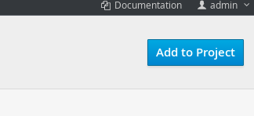
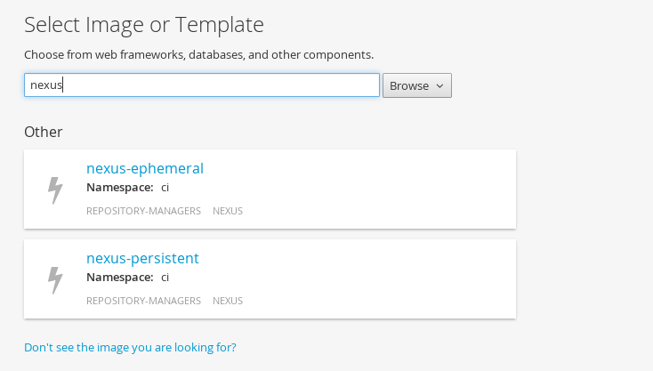
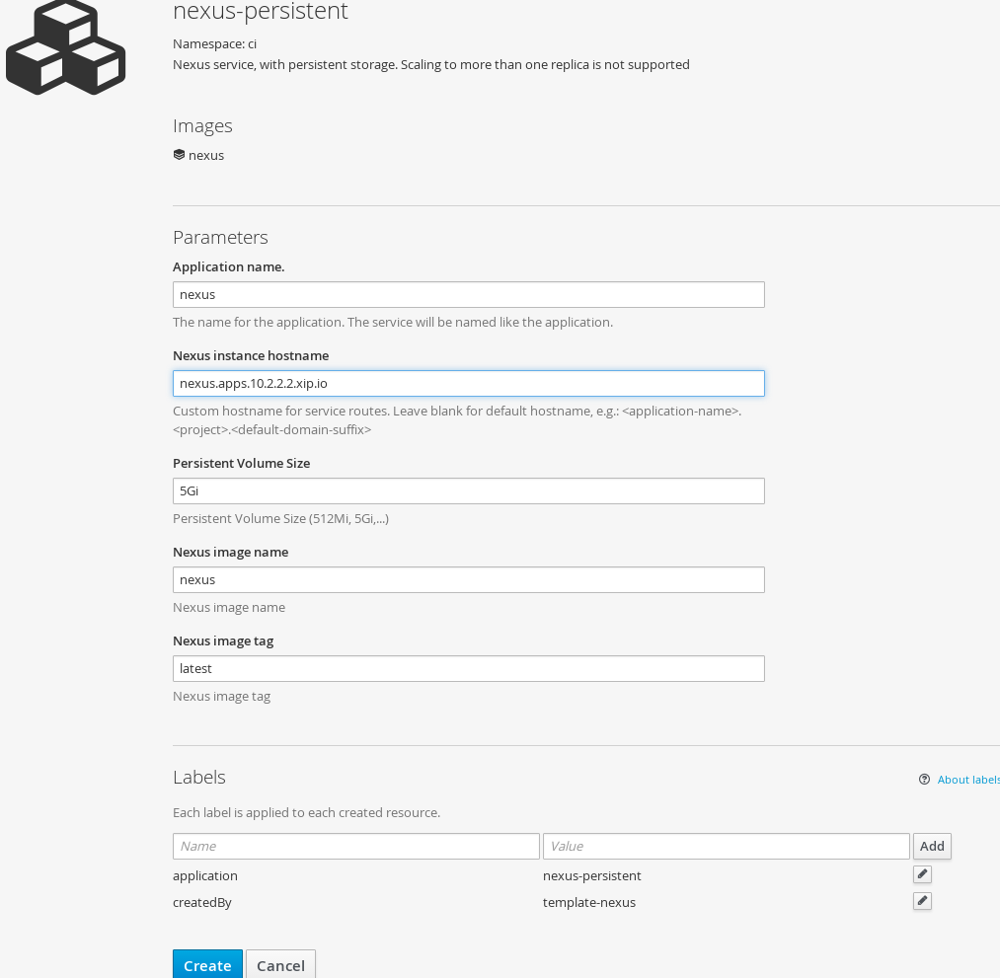
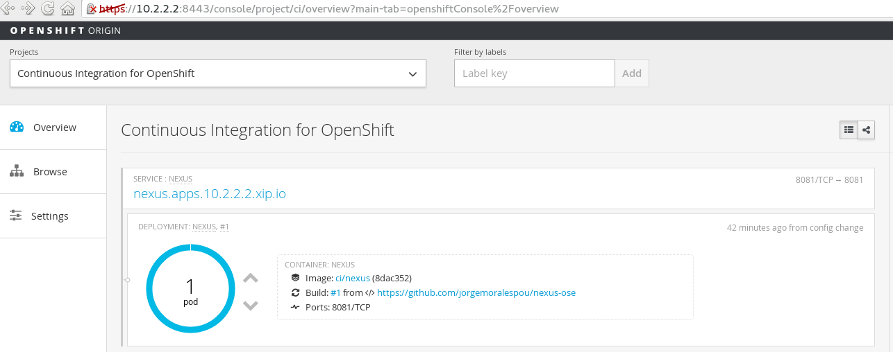
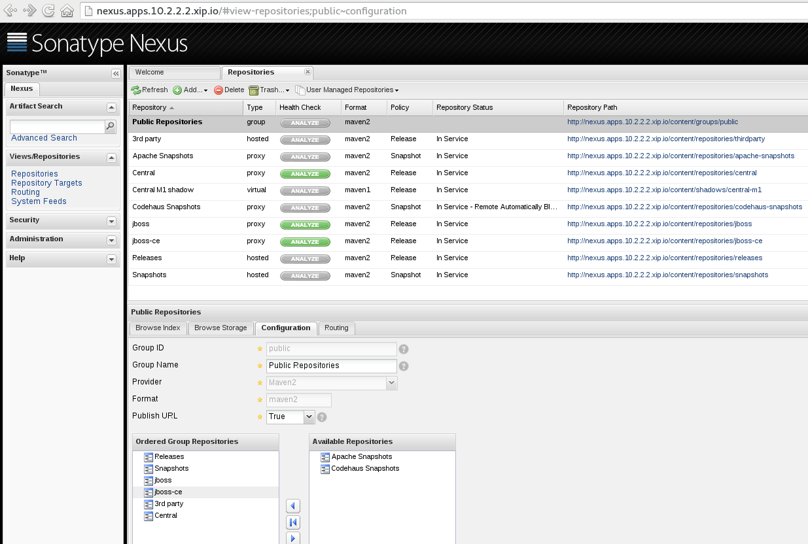

= Developing Java applications using a Nexus Container for maven dependencies in OpenShift Origin / OpenShift 3

This sample project demonstrates how you can use Nexus in an OpenShift environment. How you can create applications that will fetch the dependencies from your internal nexus container.

NOTE: This is a Proof of Concept. NOT SUPPORTED!!!

The steps that will be done are the following:

* Deploy a nexus container configured for accessing Red Hat's maven repository
* Install all base images we will be using
** Centos: centos:cetos7
** Wildfly 8: docker.io/openshift/wildfly-81-centos
** EAP 6: registry.access.redhat.com/jboss-eap-6/eap-openshift
* Create a version of wildfly and EAP S2I images that will use by default the nexus instance created
* Create a version of templates using this new S2I images
* Create a sample application using Wildfly-nexus S2I image

== Deploy a nexus container configured for accessing Red Hat's maven repository
Our nexus instance will live in a project called (*ci*), so to start, we need to create this project and add all the required resources:

Nexus 2:

----
oc new-project ci --display-name="Continuous Integration for OpenShift" --description="This project holds all continuous integration required infrastructure, like Nexus, Jenkins,..."

oc create -f nexus/ose3/nexus-resources.json -n ci
----

Nexus 3:

----
oc new-project ci --display-name="Continuous Integration for OpenShift" --description="This project holds all continuous integration required infrastructure, like Nexus, Jenkins,..."

oc create -f nexus/ose3/nexus3-resources.json -n ci
----

Nexus works better with anyuid. To enable it (as admin):

----
oc adm policy add-scc-to-user anyuid -z nexus -n ci
----

Once we have created all the nexus resources, we can go ahead and create a nexus instance. There is 2 templates for creating a Nexus instance (ephemeral and persitent) in the *ci* project.
To create your project just go do in the ci project:

* Add to project

* Select Image or Template (filter with *nexus*) and select one of the templates (nexus-persistent or nexus-ephemeral)

* Provide with the required parameters.

* Wait for deployment

* Access the console, in the provided HOSTNAME. (http://nexus.apps.10.2.2.2.xip.io in my example)

NOTE: By default, nexus credentials will be *admin/admin123*

=== Details to know
It is very important to know that the service is available through DNS internally to all other applications running in OpenShift, and externally at the provided hostname:

* *External DNS*: nexus.apps.10.2.2.2.xip.io
* *Internal DNS*: nexus.ci.svc.cluster.local

Also, important to understand that if OpenShift is configured with the SDN multitenant plugin, you need to allow access to this project (*ci*) from any other project that wants to use it, or by making the ci project global, with:

----
oadm pod-network make-projects-global ci
----

=== Defining your Persistent Volume for using nexus-persistent template
If you want to create a nexus persistent instance, you need to provide with a persistent volume named: *nexus-pv* with *ReadWriteOnce* mode and the ammount of space that you wish. You can use hostPath, nfs, or any other storage.
See examples link:nexus/ose3/resources/pv/[here].

As an example (in an all-in-one VM), you can do as root (cluster:admin) the following:

----
mkdir /tmp/nexus

chmod 777 /tmp/nexus

oc create -f - <<-EOF
{
    "apiVersion": "v1",
    "kind": "PersistentVolume",
    "metadata": {
        "name": "nexus-pv",
        "labels": {
           "type": "local"
        }
    },
    "spec": {
        "hostPath": {
            "path": "/tmp/nexus"
        },
        "accessModes": [
            "ReadWriteOnce"
        ],
        "capacity": {
            "storage": "5Gi"
        },
        "persistentVolumeReclaimPolicy": "Retain"
    }
}
EOF

oc adm policy add-scc-to-user hostaccess -z nexus -n ci
----

== Install new resources that will use Nexus
I have provided with a file that will install all the required resources needed to work with the Nexus instance provided in the OpenShift install.

To install the Wildfly version:

----
oc new-project wildfly-nexus-builds --display-name="Wildfly builds with Nexus" --description="Building Applications in Wildfly using Nexus for dependency management"

oc create -f builders/wildfly-nexus/wildfly-nexus-resources.json
----

To install the EAP version:

----
oc new-project eap-nexus-builds --display-name="EAP builds with Nexus" --description="Building Applications in EAP using Nexus for dependency management"

oc create -f builders/eap-nexus/eap-nexus-resources.json
----

Following there is a description of what these files provide.

=== ImageStreams
This project will load the required ImageStreams for Wildfly 8.1, Wildfly 9 and Wildfly 10 that are initially defined in the link:https://raw.githubusercontent.com/openshift/origin/master/examples/image-streams/image-streams-centos7.json[openshift origin project].

----
{
   "apiVersion": "v1",
   "kind": "ImageStream",
   "metadata": {
      "creationTimestamp": null,
      "name": "wildfly-8"
   },
   "spec": {
      "tags": [
         {
            "from": {
               "Kind": "ImageStreamTag",
               "Name": "8.1"
            },
            "name": "latest"
         },
         {
            "annotations": {
               "description": "Build and run Java applications on Wildfly 8.1",
               "iconClass": "icon-wildfly",
               "sampleRepo": "https://github.com/bparees/openshift-jee-sample.git",
               "supports": "wildfly:8.1,jee,java",
               "tags": "builder,wildfly,java",
               "version": "8.1"
            },
            "from": {
               "Kind": "DockerImage",
               "Name": "openshift/wildfly-81-centos7:latest"
            },
            "name": "8.1"
         }
      ]
   }
}
....
----

Also, it installs the EAP 6.4 ImageStream defined in link:https://raw.githubusercontent.com/jboss-openshift/application-templates/ose-v1.2.0/jboss-image-streams.json[JBoss Openshift application templates] project.

----
TODO: Copy content here
----

These ImageStreams provide the base images used.

We will create a new version of the S2I Builders, and for these, we also create some ImageStreams:

----
{
   "apiVersion": "v1",
   "kind": "ImageStream",
   "metadata": {
      "creationTimestamp": null,
      "name": "wildfly-nexus-8"
   },
   "spec": {
      "tags": [
         {
            "annotations": {
               "description": "Build and run Java applications on Wildfly 8.1 using Nexus",
               "iconClass": "icon-wildfly",
               "sampleRepo": "https://github.com/bparees/openshift-jee-sample.git",
               "supports": "wildfly:8.1,jee,java",
               "tags": "builder,wildfly,java,nexus",
               "version": "8.1"
            },
            "name": "latest"
         }
      ]
   }
}
...
----

=== S2I Builder images
I have created an extended version of link:builders/wildfly-nexus/8.1[Wildfly 8.1], link:builders/wildfly-nexus/9.0[Wildfly 9] and link:builders/wildfly-nexus/10.0[Wildfly 10] as well as link:builders/eap-nexus/6.4[EAP 6.4] images where I'm replacing the provided settings.xml file with one of my own, that will look for dependencies in the provided Nexus instance in the OpenShift environment.

We need a BuildConfig for each of the S2I images so that these images are created and pushed into the appropriate ImageStreams.

Here we can see the BuildConfig for the Wildfly 8.1 Image:

----
{
   "kind": "BuildConfig",
   "apiVersion": "v1",
   "metadata": {
      "name": "wildfly-nexus-8"
   },
   "spec": {
      "triggers": [
         {
            "type": "GitHub",
            "github": {
               "secret": "secret"
            }
         },
         {
            "type": "Generic",
            "generic": {
               "secret": "secret"
            }
         },
         {
            "type": "ImageChange",
            "imageChange": {}
         }
      ],
      "source": {
         "type": "Git",
         "git": {
            "uri": "https://github.com/jorgemoralespou/nexus-ose",
            "ref": "master"
         },
         "contextDir": "builders/wildfly-nexus/8.1"
      },
      "strategy": {
         "type": "Docker",
         "dockerStrategy": {
            "from": {
               "kind": "ImageStreamTag",
               "name": "wildfly-8:latest"
            }
         }
      },
      "output": {
         "to": {
            "kind": "ImageStreamTag",
            "name": "wildfly-nexus-8:latest"
         }
      },
      "resources": {}
   }
}
----

===  Templates
The Wildfly images are builder Images, so you can use it directly for creating applications. On the other hand, EAP provides with some templates for different use cases that can be used. We need to provide our own version of these templates, where we'll be changing the Builder image.

As an example, here I show a changed version of the base https://raw.githubusercontent.com/jboss-openshift/application-templates/ose-v1.2.0/eap/eap64-basic-s2i.json[EAP 6.4 Basic template].

link:builders/eap-nexus/eap-nexus-resources.json#L108-L430[See the code]

== Create a sample application

=== Sample Wildfly-nexus S2I image
